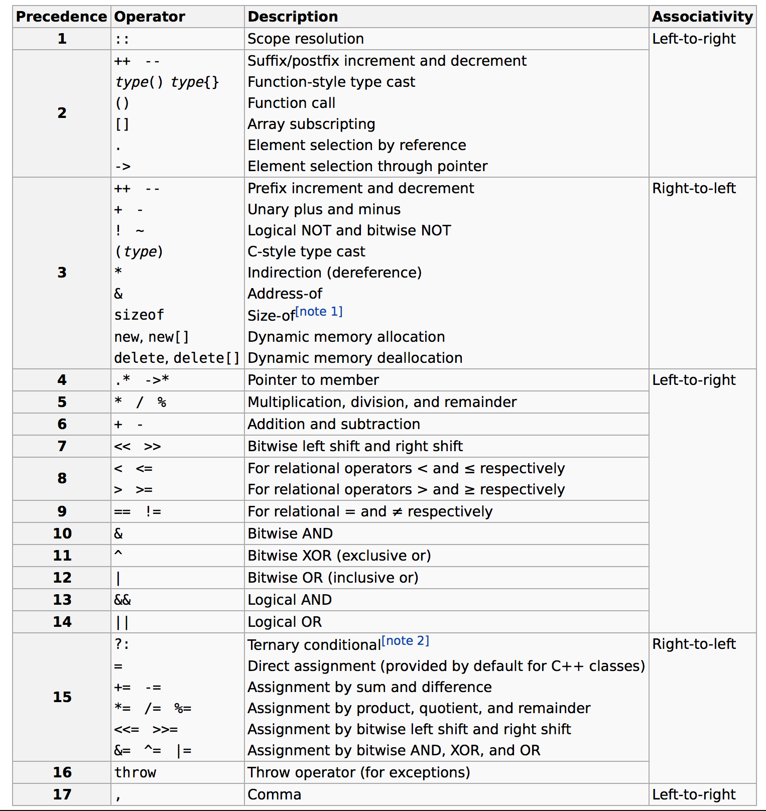

# C++ Notes

### Compiling/Linking


```bash
g++ -c file1.cpp file2.cpp file3.cpp
```


```bash
g++ -o prog file1.o file2.o file3.o
# All in one step
g++ -o prog file1.cpp file2.cpp file3.cpp
```


### Preprocessor
- The preprocessor is perhaps best thought of as a separate program that runs before the compiler when you compile your program. It's purpose is to process directives. Directives are specific instructions that start with a # symbol and end with a newline (NOT a semicolon). 

- Examples
	- #include: tells the preprocessor to insert the contents of the included file into the current file at the point of the #include directive. 
	- #define identifier replacement: Whenever the preprocessor encounters this directive, any further occurrence of "identifier" is replaced by "replacement". (e.g., #define MY_NAME "CTXue", #define YEN_PER_DOLLAR 21) 
	- __Conditional Compilation__: allows you to specify under what conditions something will or won‟t compile. 
	- e.g., #ifdef, #ifndef, and #endif. The #ifdef preprocessor directive allow the preprocessor to check whether a value has been previously #defined. If so, the code between the #ifdef and corresponding #endif is compiled. If not, the code is ignored.
	- __Header guards__: Because header files can include other header files, it is possible to end up in the situation where a header file gets included multiple times.

	```cpp
		#ifndef SOME_UNIQUE_NAME_HERE
		#define SOME_UNIQUE_NAME_HERE
		// forward declaration
		#endif
	```
	- When this header is included, the first thing it does is check whether SOME_UNIQUE_NAME_HERE has been previous defined. 

### Constant
- define constant: const double pi(3.14159);

### Operator Precedence 


### Linkage
- A variable’s linkage determines whether it can be referenced by other files.
- A variable with internal linkage is called a internal variable (or static variable), and it can only be used within the file it is defined in. A variable with external linkage is called an external variable, and it can be used both in the file it is defined in, as well as in other files.
- By default, __non-const__ variables declared outside of a block are assumed to be __external__, and __const__ variables declared outside of a block are assumed to be __internal__.
- e.g., extern const double pi(3.14);  static int internal_var;

### Namespaces
- A namespace defines an area of code in which all identifiers are guaranteed to be unique. By default, all variables and functions are defined in the global namespace.
- It’s legal to declare namespace blocks in multiple locations (even multiple times in the same file, if you can find a good reason for doing so). All declarations within the namespace block are considered part of the namespace.

```cpp
namespace Foo {
    // This doSomething() belongs to namespace Foo
    int doSomething(int x, int y) {
        return x + y;
    }
}


int main() {		
    cout << Foo::doSomething(4, 3) << endl;
    return 0;
}


int main() {

    {
        using namespace Foo;
        // calls to Foo:: stuff here
    } // using namespace Foo expires
 
    {
        using namespace Goo;
        // calls to Goo:: stuff here
    } // using namespace Goo expires
 
    return 0;
}
```

### Enumerated Types
- Enumerated types are incredibly useful for code documentation and readability purposes when you need to represent a specific, predefined set of states.

```cpp
enum Color {
	RED,
	BLUE, // BLUE is put into the global namespace
	GREEN
};

enum Feeling {
	HAPPY,
	TIRED,
	BLUE // error, BLUE was already used in enum Color in the global namespace
};

Color vertex = BLUE;
switch(vertex) {
     case RED   : std::cout << "red"   "\n"; break;
     case GREEN : std::cout << "green" "\n"; break;
     case BLUE  : std::cout << "blue"  "\n"; break;
}

// example: states tracking
enum ParseResult {
    SUCCESS = 0,
    ERROR_OPENING_FILE = -1,
    ERROR_READING_FILE = -2,
    ERROR_PARSING_FILE = -3,
};
 
ParseResult ParseFile() {

    if (!OpenFile())
        return ERROR_OPENING_FILE;
    if (!ReadFile())
        return ERROR_READING_FILE;
    if (!Parsefile())
        return ERROR_PARSING_FILE;
 
    return SUCCESS;
}

if (ParseFile() == SUCCESS) {
    // do something
    } else {
    // print error message
    }

// enum class type => Strong enum class type defined in C++ 11
```

### Typedefs
- Typedefs allow the programmer to create an alias for a data type, and use the aliased name instead of the actual type name. To declare a typedef, simply use the typedef keyword, followed by the type to alias, followed by the alias name:

```cpp
// typedef Exist New
typedef long miles; // define miles as an alias for long

// The following two statements are equivalent:
long nDistance;
miles nDistance;

#ifdef INT_2_BYTES
typedef char int8;
typedef int int16;
typedef long int32;
#else
typedef char int8;
typedef short int16;
typedef int int32;
#endif

```

### Struct
```cpp
struct Employee {
    int ID;
    int age;
    float wage;
};
 
struct Company {
    Employee CEO;
    int numberOfEmployees;
};
 
Company company = {{1, 42, 60000.0f}, 21};

```

### Switch/For/While

```cpp
enum Colors {
    COLOR_BLACK,
    COLOR_WHITE,
    COLOR_RED,
    COLOR_GREEN,
    COLOR_BLUE,
};
 
void PrintColor(Colors eColor) {
    using namespace std;
    switch (eColor)
    {
        case COLOR_BLACK:
            cout << "Black";
            break;
        case COLOR_WHITE:
            cout << "White";
            break;
        case COLOR_RED:
            cout << "Red";
            break;
        case COLOR_GREEN:
            cout << "Green";
            break;
        case COLOR_BLUE:
            cout << "Blue";
            break;
        default:
            cout << "Unknown";
            break;
    }
}

//infinite for loop
for (;;)
    statement;

//infinite while loop
while (true)
    statement;
```

### Break and Continue
- The break statement causes a switch statement, while loop, do while loop, or for loop to terminate.
- The continue statement provides a convenient way to jump back to the top of a loop earlier than normal, which can be used to bypass the remainder of the loop for an iteration.

### Array
```cpp
enum StudentNames {
    KENNY, // 0
    KYLE, // 1
    STAN, // 2
    BUTTERS, // 3
    CARTMAN, // 4
    WENDY, // 5
    MAX_STUDENTS // 6
};
 
int testScores[MAX_STUDENTS]; // allocate 6 integers
testScores[KYLE] = 21;

int anArray[3][5] = { 0 };
```

### Dynamic Memory Allocation

```cpp
int *value = new int;
*value = 21;

delete value;
value = NULL;

int *array = new int[10];
delete[] array;

// Memory Leak Q1
void doSomething() {
    int *pnValue = new int;
}

// Q2
int nValue = 21;
int *pnValue = new int;
pnValue = &nValue; // old address lost, memory leak results

// Q3
int *pnValue = new int;
pnValue = new int; // old address lost, memory leak results

// Good habit to set a pointer to NULL after deletion
int *value = new int;
delete value; // pnValue not set to 0
 
if (value)
    *value = 21; // will cause a crash

//Finally, deleting a null pointer has no effect. 

```

### References
- Because references always “point” to valid objects, and can never be pointed to deallocated memory, references are safer to use than pointers. If a task can be solved with either a reference or a pointer, the reference should generally be preferred. Pointers should generally only be used in situations where references are not sufficient (such as dynamically allocating memory).

```cpp
int value = 21; // normal integer
int &ref = value; // reference to value 

value++;
cout << ref << endl; //print 22

//both &value and &ref have the same address value

int *&refPtr; // a reference to a pointer

//pass in a pointer as parameter is actually passing it in as value (copy)

// tempPtr is now a reference to a pointer to pPtr!
// This means if we change tempPtr, we change pPtr!
void setValue(int* &tempPtr) {
    using namespace std;
    tempPtr = &value;
}
```

- Return by reference is typically used to return arguments passed by reference to the function back to the caller.
- Return by address is often used to return newly allocated memory to the caller.
- When using return by reference or address, make sure you are not returning a reference to, or the address of, a variable that will go out of scope when the function returns. (e.g., local variables)

```cpp
int* AllocateArray(int nSize) {
    return new int[nSize];
}
 
int main() {
    int *pnArray = AllocateArray(25);
    // do stuff with pnArray
 
    delete[] pnArray;
    return 0;
}
```

### Function Overloading
- Function overloading is a feature of C++ that allows us to create multiple functions with the same name, so long as they have different parameters. 

### Function Pointers
```cpp
typedef bool (*Compare)(int, int);

bool validate(int x, int y, Compare compare) {
    return (*compare)(x, y);
}

bool isGreater(int x, int y) {
    cout << "Result: " << (x > y ? x : y) << endl;
    return true;
}

int main() {
    validate(10, 20, isGreater);
    //print result: 20 and return true
}
```

### The Stack and the Heap
- The heap (also known as the “free store”) is a large pool of memory used for dynamic allocation. In C++, when you use the new operator to allocate memory, this memory is assigned from the heap.
    - Allocated memory stays allocated until it is specifically deallocated (beware memory leaks).
    - Dynamically allocated memory must be accessed through a pointer.
    - Because the heap is a big pool of memory, large arrays, structures, or classes should be allocated here.
- A stack is a last-in, first-out (LIFO) structure. The last item pushed onto the stack will be the first item popped off. 
- So what do we push onto our call stack? Parameters, local variables, and… function calls.

### Handling Errors 
```cpp
int anArray[10]; // a global array of 10 characters
 
#include <cassert> // for assert()
int getArrayValue(int index) {
    assert(index >= 0 && index <= 9);
    return anArray[index];
}

//if getArrayValue(-1) is called, >> Assertion failed: index >= 0 && index <=9, file test.cpp, line X

```
### OOP in C++
- Public members of a class A are accessible for all and everyone.
- Protected members of a class A are not accessible outside of A's code, but is accessible from the code of any class derived from A.
- Private members of a class A are not accessible outside of A's code, or from the code of any class derived from A.
- By default, all members (instance variables + methods) of a class are private in C++.

```cpp
class Person {
    public:
        string name;
        int age;
        string address;

    void printInfo() {
        cout << "Name: " << this.name << endl;
        cout << "Age: " << this.age << endl;
        cout << "Address: " << this.address << endl;
    }
}
```

### Template
