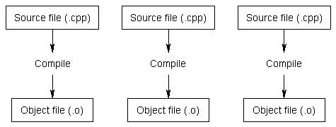

# C++ Notes

### Compiling/Linking


```bash
g++ -c file1.cpp file2.cpp file3.cpp
```


```bash
g++ -o prog file1.o file2.o file3.o
# All in one step
g++ -o prog file1.cpp file2.cpp file3.cpp
```


### Preprocessor
- The preprocessor is perhaps best thought of as a separate program that runs before the compiler when you compile your program. It's purpose is to process directives. Directives are specific instructions that start with a # symbol and end with a newline (NOT a semicolon). 

- Examples
	- #include: tells the preprocessor to insert the contents of the included file into the current file at the point of the #include directive. 
	- #define identifier replacement: Whenever the preprocessor encounters this directive, any further occurrence of "identifier" is replaced by "replacement". (e.g., #define MY_NAME "CTXue", #define YEN_PER_DOLLAR 21) 
	- __Conditional Compilation__: allows you to specify under what conditions something will or won‟t compile. 
	- e.g., #ifdef, #ifndef, and #endif. The #ifdef preprocessor directive allow the preprocessor to check whether a value has been previously #defined. If so, the code between the #ifdef and corresponding #endif is compiled. If not, the code is ignored.
	- __Header guards__: Because header files can include other header files, it is possible to end up in the situation where a header file gets included multiple times.

	```cpp
		#ifndef SOME_UNIQUE_NAME_HERE
		#define SOME_UNIQUE_NAME_HERE
		// forward declaration
		#endif
	```
	- When this header is included, the first thing it does is check whether SOME_UNIQUE_NAME_HERE has been previous defined. 

### Constant
- define constant: const double pi(3.14159);

### Operator Precedence 


### Linkage
- A variable’s linkage determines whether it can be referenced by other files.
- A variable with internal linkage is called a internal variable (or static variable), and it can only be used within the file it is defined in. A variable with external linkage is called an external variable, and it can be used both in the file it is defined in, as well as in other files.
- By default, __non-const__ variables declared outside of a block are assumed to be __external__, and __const__ variables declared outside of a block are assumed to be __internal__.
- e.g., extern const double pi(3.14);  static int internal_var;

### Namespaces
- A namespace defines an area of code in which all identifiers are guaranteed to be unique. By default, all variables and functions are defined in the global namespace.
- It’s legal to declare namespace blocks in multiple locations (even multiple times in the same file, if you can find a good reason for doing so). All declarations within the namespace block are considered part of the namespace.

```cpp
namespace Foo {
    // This doSomething() belongs to namespace Foo
    int doSomething(int x, int y) {
        return x + y;
    }
}


int main() {		
    cout << Foo::doSomething(4, 3) << endl;
    return 0;
}


int main() {

    {
        using namespace Foo;
        // calls to Foo:: stuff here
    } // using namespace Foo expires
 
    {
        using namespace Goo;
        // calls to Goo:: stuff here
    } // using namespace Goo expires
 
    return 0;
}
```

### Enumerated Types
- Enumerated types are incredibly useful for code documentation and readability purposes when you need to represent a specific, predefined set of states.

```cpp
enum Color {
	RED,
	BLUE, // BLUE is put into the global namespace
	GREEN
};

enum Feeling {
	HAPPY,
	TIRED,
	BLUE // error, BLUE was already used in enum Color in the global namespace
};

Color vertex = BLUE;
switch(vertex) {
     case RED   : std::cout << "red"   "\n"; break;
     case GREEN : std::cout << "green" "\n"; break;
     case BLUE  : std::cout << "blue"  "\n"; break;
}

// example: states tracking
enum ParseResult {
    SUCCESS = 0,
    ERROR_OPENING_FILE = -1,
    ERROR_READING_FILE = -2,
    ERROR_PARSING_FILE = -3,
};
 
ParseResult ParseFile() {

    if (!OpenFile())
        return ERROR_OPENING_FILE;
    if (!ReadFile())
        return ERROR_READING_FILE;
    if (!Parsefile())
        return ERROR_PARSING_FILE;
 
    return SUCCESS;
}

if (ParseFile() == SUCCESS) {
    // do something
    } else {
    // print error message
    }

// enum class type => Strong enum class type defined in C++ 11
```

### Typedefs
- Typedefs allow the programmer to create an alias for a data type, and use the aliased name instead of the actual type name. To declare a typedef, simply use the typedef keyword, followed by the type to alias, followed by the alias name:

```cpp
// typedef Exist New
typedef long miles; // define miles as an alias for long

// The following two statements are equivalent:
long nDistance;
miles nDistance;

#ifdef INT_2_BYTES
typedef char int8;
typedef int int16;
typedef long int32;
#else
typedef char int8;
typedef short int16;
typedef int int32;
#endif

```

### Struct
```cpp
struct Employee {
    int ID;
    int age;
    float wage;
};
 
struct Company {
    Employee CEO;
    int numberOfEmployees;
};
 
Company company = {{1, 42, 60000.0f}, 21};

```

### Switch/For/While

```cpp
enum Colors {
    COLOR_BLACK,
    COLOR_WHITE,
    COLOR_RED,
    COLOR_GREEN,
    COLOR_BLUE,
};
 
void PrintColor(Colors eColor) {
    using namespace std;
    switch (eColor)
    {
        case COLOR_BLACK:
            cout << "Black";
            break;
        case COLOR_WHITE:
            cout << "White";
            break;
        case COLOR_RED:
            cout << "Red";
            break;
        case COLOR_GREEN:
            cout << "Green";
            break;
        case COLOR_BLUE:
            cout << "Blue";
            break;
        default:
            cout << "Unknown";
            break;
    }
}

//infinite for loop
for (;;)
    statement;

//infinite while loop
while (true)
    statement;
```

### Break and Continue
- The break statement causes a switch statement, while loop, do while loop, or for loop to terminate.
- The continue statement provides a convenient way to jump back to the top of a loop earlier than normal, which can be used to bypass the remainder of the loop for an iteration.

### Array
```cpp
enum StudentNames {
    KENNY, // 0
    KYLE, // 1
    STAN, // 2
    BUTTERS, // 3
    CARTMAN, // 4
    WENDY, // 5
    MAX_STUDENTS // 6
};
 
int testScores[MAX_STUDENTS]; // allocate 6 integers
testScores[KYLE] = 21;

int anArray[3][5] = { 0 };
```

### Dynamic Memory Allocation

```cpp
int *value = new int;
*value = 21;

delete value;
value = NULL;

int *array = new int[10];
delete[] array;

// Memory Leak Q1
void doSomething() {
    int *pnValue = new int;
}

// Q2
int nValue = 21;
int *pnValue = new int;
pnValue = &nValue; // old address lost, memory leak results

// Q3
int *pnValue = new int;
pnValue = new int; // old address lost, memory leak results

// Good habit to set a pointer to NULL after deletion
int *value = new int;
delete value; // pnValue not set to 0
 
if (value)
    *value = 21; // will cause a crash

//Finally, deleting a null pointer has no effect. 

```

### References
- Because references always “point” to valid objects, and can never be pointed to deallocated memory, references are safer to use than pointers. If a task can be solved with either a reference or a pointer, the reference should generally be preferred. Pointers should generally only be used in situations where references are not sufficient (such as dynamically allocating memory).

```cpp
int value = 21; // normal integer
int &ref = value; // reference to value 

value++;
cout << ref << endl; //print 22

//both &value and &ref have the same address value

int *&refPtr; // a reference to a pointer

//pass in a pointer as parameter is actually passing it in as value (copy)

// tempPtr is now a reference to a pointer to pPtr!
// This means if we change tempPtr, we change pPtr!
void setValue(int* &tempPtr) {
    using namespace std;
    tempPtr = &value;
}
```

- Return by reference is typically used to return arguments passed by reference to the function back to the caller.
- Return by address is often used to return newly allocated memory to the caller.
- When using return by reference or address, make sure you are not returning a reference to, or the address of, a variable that will go out of scope when the function returns. (e.g., local variables)

```cpp
int* AllocateArray(int nSize) {
    return new int[nSize];
}
 
int main() {
    int *pnArray = AllocateArray(25);
    // do stuff with pnArray
 
    delete[] pnArray;
    return 0;
}
```

### Function Overloading
- Function overloading is a feature of C++ that allows us to create multiple functions with the same name, so long as they have different parameters. 

### Function Pointers
```cpp
typedef bool (*Compare)(int, int);

bool validate(int x, int y, Compare compare) {
    return (*compare)(x, y);
}

bool isGreater(int x, int y) {
    cout << "Result: " << (x > y ? x : y) << endl;
    return true;
}

int main() {
    validate(10, 20, isGreater);
    //print result: 20 and return true
}
```

### The Stack and the Heap
- The heap (also known as the “free store”) is a large pool of memory used for dynamic allocation. In C++, when you use the new operator to allocate memory, this memory is assigned from the heap.
    - Allocated memory stays allocated until it is specifically deallocated (beware memory leaks).
    - Dynamically allocated memory must be accessed through a pointer.
    - Because the heap is a big pool of memory, large arrays, structures, or classes should be allocated here.
- A stack is a last-in, first-out (LIFO) structure. The last item pushed onto the stack will be the first item popped off. 
- So what do we push onto our call stack? Parameters, local variables, and… function calls.

### Handling Errors 
```cpp
int anArray[10]; // a global array of 10 characters
 
#include <cassert> // for assert()
int getArrayValue(int index) {
    assert(index >= 0 && index <= 9);
    return anArray[index];
}

//if getArrayValue(-1) is called, >> Assertion failed: index >= 0 && index <=9, file test.cpp, line X

```
### OOP in C++
- Public members of a class A are accessible for all and everyone.
- Protected members of a class A are not accessible outside of A's code, but is accessible from the code of any class derived from A.
- Private members of a class A are not accessible outside of A's code, or from the code of any class derived from A.
- By default, all members (instance variables + methods) of a class are private in C++.

```cpp
class Person {
    public:
        string name;
        int age;
        string address;

    void printInfo() {
        cout << "Name: " << this->name << endl;
        cout << "Age: " << this->age << endl;
        cout << "Address: " << this->address << endl;
    }

    Person() {
        name = "Steve Nash";
        age = 21;
        address = "Vancouver Canada";        
    }

    Person(string name, int age, string address) {
        this->name = name;
        this->age = age;
        this->address = address;        
    }  

    ~Person() {
        //destructor
    }  
}
```

- A __destructor__ is another special kind of class member function that is executed when an object of that class is destroyed. They are the counterpart to constructors. When a variable goes out of scope, or a dynamically allocated variable is explicitly deleted using the delete keyword, the class destructor is called (if it exists) to help clean up the class before it is removed from memory. 

- In a __composition__, the complex object “owns” all of the subobjects it is composed of. When a composition is destroyed, all of the subobjects are destroyed as well. 
- An __aggregation__ is a specific type of composition where no ownership between the complex object and the subobjects is implied. When an aggregate is destroyed, the subobjects are not destroyed.

- Compositions:
    - Typically use normal member variables
    - Can use pointer values if the composition class automatically handles allocation/deallocation
    - Responsible for creation/destruction of subclasses
- Aggregations:
    - Typically use pointer variables that point to an object that lives outside the scope of the aggregate class
    - Can use reference values that point to an object that lives outside the scope of the aggregate class
    - Not responsible for creating/destroying subclasses

### Header & Body File 
```cpp
// Date.h
#ifndef DATE_H
#define DATE_H
 
class Date {
private:
    int m_nMonth;
    int m_nDay;
    int m_nYear;
 
    Date() { } // private default constructor
 
public:
    Date(int nMonth, int nDay, int nYear);
 
    void SetDate(int nMonth, int nDay, int nYear);
 
    int GetMonth() { return m_nMonth; }
    int GetDay()  { return m_nDay; }
    int GetYear() { return m_nYear; }
};
 
#endif


// Date.cpp

#include "Date.h"
 
// Date constructor
Date::Date(int nMonth, int nDay, int nYear) {
    SetDate(nMonth, nDay, nYear);
}
 
// Date member function
void Date::SetDate(int nMonth, int nDay, int nYear) {
    m_nMonth = nMonth;
    m_nDay = nDay;
    m_nYear = nYear;
}
```

### Friend functions
- A friend function is a function that can access the private members of a class as though it were a member of that class. In all other regards, the friend function is just like a normal function.
- Overloading the operators uses a lot friend functions

### Shallow vs. Deep Copying
- A shallow copy means that C++ copies each member of the class individually using the assignment operator. When classes are simple (eg. do not contain any dynamically allocated memory), this works very well.
-  A deep copy duplicates the object or variable being pointed to so that the destination (the object being assigned to) receives it’s own local copy. This way, the destination can do whatever it wants to it’s local copy and the object that was copied from will not be affected. 
- Doing deep copies requires that we write our own copy constructors and overloaded assignment operators.

### Constructor Initialization Lists
- The initialization list is inserted after the constructor parameters, begins with a colon (:), and then lists each variable to initialize along with the value for that variable separated by a comma. Note that we no longer need to do the explicit assignments in the constructor body, since the initialization list replaces that functionality.
- It's the only way to initialize const data members. (e.g., const int x;)

```cpp
class Something {
private:
    int nValue;
    double dValue;
    int *pnValue;
 
public:
    Something() : nValue(0), dValue(0.0), pnValue(0) {
    }
};
```

### Container Classes
- A container class is a class designed to hold and organize multiple instances of another class.
- Value container -> composition, Reference container -> aggregation

### Inheritance
- Everytime instantiate a derived class, all its ancestor classes' constructors will be called as well

```cpp
class A {
public:
    int x;
protected:
    int y;
private:
    int z;
};

class B : public A {
    // x is public
    // y is protected
    // z is not accessible from B
};

class C : protected A {
    // x is protected
    // y is protected
    // z is not accessible from C
};

class D : private A {
    // x is private
    // y is private
    // z is not accessible from D
};
// The default type of the inheritance is private. 
// Including methods, everything will turn into private
```

- A class is made abstract by declaring at least one of its functions as pure virtual function. A pure virtual function is specified by placing "= 0" in its declaration as follows:

```cpp
class Box {
   public:
      // pure virtual function
      virtual double getVolume() = 0;
   private:
      double length;      // Length of a box
      double breadth;     // Breadth of a box
      double height;      // Height of a box
};

- An __interface__ class is a class that has no members variables, and where all of the functions are pure virtual.
- Interfaces can be passed as function parameters (a good practice)

```cpp
class IErrorLog {
    virtual bool OpenLog(const char *strFilename) = 0;
    virtual bool CloseLog() = 0;
    virtual bool WriteError(const char *strErrorMessage) = 0;
};

// Interface as parameters class: FileErrorLog: public IErrorLog

double MySqrt(double dValue, FileErrorLog &cLog) {
    //doSomething
}

double MySqrt(double dValue, IErrorLog &cLog) {
    //doSomething
}
```

```

### Input and Output (I/O)
//TODO

### Template
- In C++, function templates are functions that serve as a pattern for creating other similar functions. 
- The basic idea behind function templates is to create a function without having to specify the exact type(s) of some or all of the variables. 
- Instead, we define the function using placeholder types, called template type parameters. Once we have created a function using these placeholder types, we have effectively created a “function stencil”.
- Function Template VS Class Template

```cpp
//Function Template:

int max(int X, int Y) {
    return (X > Y) ? X : Y;
}

template <typename Type> // this is the template parameter declaration
Type max(Type X, Type Y) {
    return (X > Y) ? X : Y;
}

template <typename T1, typename T2> // declare multiple types inside of < >
// template function here


// Class Template:
using namespace std;

template <class T>
class Stack { 
  private: 
    vector<T> elems;     // elements 

  public: 
    void push(T const&);  // push element 
    void pop();               // pop element 
    T top() const;            // return top element 
    bool empty() const{       // return true if empty.
        return elems.empty(); 
    } 
}; 

template <class T>
void Stack<T>::push (T const& elem) { 
    // append copy of passed element 
    elems.push_back(elem);    
} 

template <class T>
void Stack<T>::pop () { 
    if (elems.empty()) { 
        throw out_of_range("Stack<>::pop(): empty stack"); 
    }
    // remove last element 
    elems.pop_back();         
} 

template <class T>
T Stack<T>::top () const { 
    if (elems.empty()) { 
        throw out_of_range("Stack<>::top(): empty stack"); 
    }
    // return copy of last element 
    return elems.back();      
} 

int main() { 
    try { 
        Stack<int>    intStack;       // stack of ints 
        Stack<string> stringStack;    // stack of strings 

        // manipulate int stack 
        intStack.push(7); 
        cout << intStack.top() <<endl; 

        // manipulate string stack 
        stringStack.push("hello"); 
        cout << stringStack.top() << std::endl; 
        stringStack.pop(); 
        stringStack.pop(); 
    } 
    catch (exception const& ex) { 
        cerr << "Exception: " << ex.what() <<endl; 
        return -1;
    } 
} 

```

- A __template expression parameter__ is a parameter that does not substitute for a type, but is instead replaced by a value. 
- When instantiating a template class for a given type, the compiler stencils out a copy of each templated member function, and replaces the template type parameters with the actual types used in the variable declaration. 
- Partial template specialization: Specify class/method definitions for specific data type (e.g., double)

```cpp 
template <class T>
class Base {
    private:
        T count;
    public:
        Base(T c): count(c) {
            cout << "Base Created with TC" << endl;
        }
};

template <>
class Base<float> {
    private:
        float count;
    public:     
        Base<float>(float c):count(c) {
            cout << "Specialized Template: Base Created with Float" << endl;
        } 
};


int main(int argc, char *argv[]) {
    Base<int> base1(21);        //Base Created with TC
    Base<float> base2(20.21);   //Specialized Template: Base Created with Float
    
}

//type as a pointer 
template <class T>
class Storage<T*> {
    // this is specialization of Storage that works with pointer types
}

```

### Exception Handling
```cpp
try {
    throw DATA_TYPE
} catch(DATA_TYPE e) {
    //doSomething
}

// catch all-exceptions hanlder
try {
    // ...
} catch (...) {
    // ...
}

```

### Standard Template Library (STL)
- A __vector__ is a dynamic array capable of growing as needed to contain its elements. 
- A __set__ is a container that stores unique elements, with duplicate elements disallowed. The elements are sorted according to their values
- A __map__ (also called an associative array) is a set where each element is a pair, called a key/value pair. The key is used for sorting and indexing the data, and must be unique. The value is the actual data.
- A __stack__ is a container where elements operate in a LIFO (Last In, First Out) context, where elements are inserted (pushed) and removed (popped) from the end of the container. Stacks default to using deque as their default sequence container (which seems odd, since vector seems like a more natural fit), but can use vector or list as well.
- A __queue__ is a container where elements operate in a FIFO (First In, First Out) context, where elements are inserted (pushed) to the back of the container and removed (popped) from the front. Queues default to using deque, but can also use list.
- A __priority queue__ is a type of queue where the elements are kept sorted (via operator<). When elements are pushed, the element is sorted in the queue. Removing an element from the front returns the highest priority item in the priority queue.
- Others: <algorithm>, etc

### C++ 11
- auto, decltype, nullptr, and enum classes
- override, final, default, and delete
- Delegating Constructors
- Initializer Lists & Uniform Initialization
- Range-based for statements

[Reference: learncpp.com](http://www.learncpp.com)

## C++ Extra Notes
```cpp
// Allocate 6 bytes in the stack and store "hello" in them
char stack[] = "hello";

// Allocate pointer on the stack and point it to a static, read-only buffer
// containing "hello"
const char *heap = "hello";

// Malloc 5 bytes (which isn't enough to hold "hello" due to the NUL byte)
char *heap_string_malloc = malloc(5);

// Reset heap_string_malloc to point to a static buffer; memory leak!
heap_string_malloc = "hello";
```

### TODO: C++ Forward Declaration vs Include
